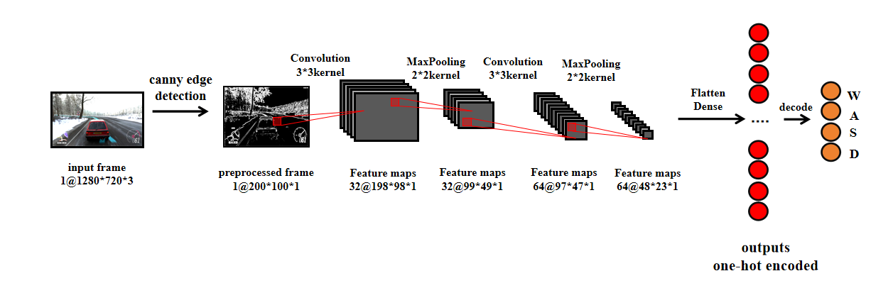
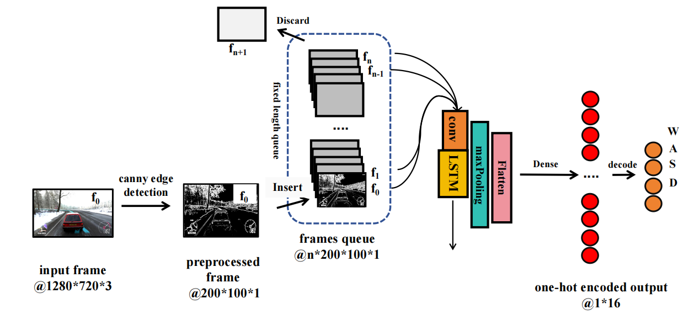

# AI Plays Horizon 4

## introduction

### overall

Forza Horizon 4 is a very popular and well known single
and multiplayer cross-platform racing game.
The main gameplay of the game is to drive a vehicle 
and then follow a fixed route (players must pass all the check points along the way), then try your best to be the first to cross 
the finish line.

The ultimate goal of this project is to create an ML model that can play this game
fully automated at an acceptable skill, allowing us to win or 
complete a race even if we are away from the keyboard. 

It is important to note that this project focuses on allowing
the model to clone human behavior and does not access to any of 
the game's built-in APIs (actually there's no such kind of APIs at all), and that the information 
(mostly visual) that the real player gets while playing 
will be used as the __only__ input to the model.
The model's outputs are also identical to the player's, 
i.e. keyboard action.

here's how I develop everything

1. Generating datasets by recording human's gameplay (a sample is consists of screen and the keyboard actions)
2. Data preprocessing (cropping, resizing, gray-scaling, canny edge detection etc.)
3. Training with different models
4. evaluate performance in actual game environments(Forza Horizon 4)

I used two kinds of models to try to accomplish this goal.
* a regular convolutional neural network
* a convLSTM

it is worth mentioning that no matter which method is used,
the inputs and the outputs are the identical from an external 
perspective, i.e. __a frame is used as the input and the 
model predicts the corresponding keyboard action.__

Theoretically, the performance of the convLSTM 
network should be better than that of a regular CNN network. 
This is because convLSTM enables the model to take more 
than just the current frame into account when making decisions.
The information contained in past frames is also selectively
retained to influence the current decision. Unlike CNNs,
the decision output from CNNs depends entirely on the
information in the current frame. Consider either real
life car driving or car driving in a game. When making
some difficult maneuvers, such as turning. How humans 
operate the steering wheel is also a process that requires 
reference to past short-term memory. 

One more thing I must
point out is that no matter which model structure is used. 
The driving level of the real human player
who recorded the training set will be the __upper limit__
of the model's driving ability. This is because the model
is always just approaching and mimicking the behavior of 
the training set. If you want the model to achieve a 
breakthrough in driving skill, perhaps reinforcement
training is a better option.

### CNN

### convLSTM

The convLSTM has a very important parameter 
with respect to the CNN. 
It is the _time step_
of the LSTM network. In the case of images,
its value is $n$. Unlike CNNs which feed 
a single image into the model at a time, convLSTM feeds a sequence of images into the model. 
In this project it is a sequence of images from the past $n$ frames. We need to feed the LSTM with $n$
frames from $f_n$ until $f_0$ so that the convLSTM can make decisions based 
on the information it gets from $f_n$ to $f_0$.

In Python.
I used queue structure to store the past $n$ frames, 
which is surrounded by blue dotted lines on the picture. 
As the game progresses, we get a new frame $f_0$ and add it to the queue,
since the length of the queue is fixed, we remove the oldest $f_{n+1}$ frame 
from the queue so that the queue always holds the current
frame and the $n$ frames before the current frame for input to the convLSTM.

## Getting Started

### Step1 : create a dataset

You need to collect real human in-game actions and the corresponding game 
screens as a training set. Here you can choose to record your own training 
set using the python script I provided or download the training set I previously collected.

> sorry, the download service of my website is currently unavailable.
> please send a message to chickenbilibili@outlook.com to acquire this dataset.
 
[Download  dataset-0.npy](not_available)

If you want to create your own dataset, here's how:

*  1._Confirm the frame capturing area_: use __DataCollection/CapturePreview.py__ 
to preview the frame capture
zone, 
*  2._Start recording your gameplay_: After you confirm the frame capturing area, in directory
__DataCollection__,
make sure the parameter of _grab_screen()_
in __DataCollection.py__ is identical to the one of _grab_screen()_'s in __ModelPreview.py__
*  Find more details in code comments

### Step3 : preview the dataset

You can preview the dataset with the script I provided,
__DataCollection/DataPreview.py__ This will sequentially play the frame and the corresponding 
label which is a four element long vector : _[W,A,S,D]_ 

*   it just like playing a video

### Step4 : preprocess, train, preview and finally play model

Inside __CNN__ and __convLSTM__ directories, you can preprocess, train,
preview and play the corresponding 
model.

 __DataPreprocess.py__  performed label balancing,
one-hot encoding and more to the dataset.
For convLSTM in particular, its __DataPreprocess.py__ also includes converting
the dataset into sequential samples according to a specified _time step_.

after data preprocessing, use __trainModel.py__ to train and __ModelPreview.py__ to preview.

not finished yet......

